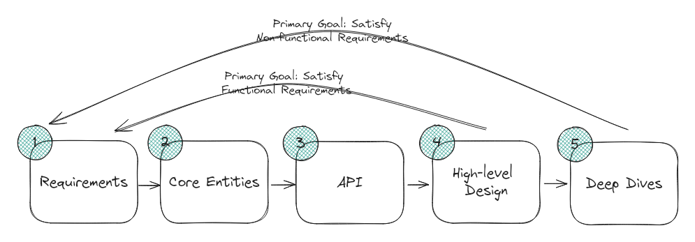

# ToDo:

- Donne Martin System Design
- Hello Interview System Design - Covers top k and geolocation
  - Ad Click Aggregator
  - Live Chat

# Curious:

- Deep dive - Satisfy NFR - Is this LB / Multiple instances ?
- Core concepts - Indexing, Protocol, locking - No sharding / Federation ?
- Key technologies and tools ?
- API Design ? DB and Schema Design ? Common AWS technologies ?
- Message Queue structure
- Protocol structure
- Websockets vs HTTPs - Stateful vs stateless
- JWT vs session/cookie based storage
- fan out on read and fan out on write ?
- Should you call out cache and message queue - in deep dive vs HLD ?
- Fanout ?
- consistent hashing - Circular organization of the databases/servers and the clocking the resources on the clock and moving to the destination closest to the destination
- How do we handle locks ?
- gRPC when to use ?
- inverted index
- DB - optimization of faster retrieval and scaling
- replication of data vs scaling or having multiple shards - can you shard and replicate data is it common ?
- what is a topic in queues ?
- Analytic services
- Row level isolation - serializable read commit

# Section 1:

## Chapter 1:

### Mindset/Approach:

- Break the problem down into smaller pieces - tackle the important pieces
  - Solve Smaller pieces with **Core Concepts**
  - Recognizing common technologies and applying them
- Move forward when you're stuck
- Don't be defensive on feedback - work with interviewer to solve the problem

# Section 2

## Delivery Framework

- **Requirements**:

  - Functional Requirements
  - Non Functional Requirements
    - CAP
    - Scalable/Throughput
    - Latency
    - Fault tolerance
    - Env - devices the application is going to run on
    - compliance
    - security
  - (?)Back of the envelope calculations
    - DAU, Schema amount of memory using
  - Core Entities
  - **API Design**
    - REST vs GraphQL - REST
    - Wire Protocol - HTTPs / Long Polling / Server Side Events / Websockets
  - High Level Design (Functional Requirements)
  - Deep Dive (Non Functional Requirements)

## Core Concepts

- Scaling
- CAP
- indexing
- Locking
- Wire Protocol

### Scaling

- Scaling/Throughput -> # of users per minuete
  - Vertical - Adding more CPU/RAM power
  - Horizontal:
    - Adding more PCs - Leads to higher level of complexity in terms of managing data
    - Work Distribution: For servers - Stateless data (Does not persist)
      - Consistent Hashing and Round Robin popular for distributing workload through LB and Async workload
    - Data Distribution:
      - Adds complexity in terms of consistency of data across nodes
        - When a server needs to pull data from various nodes to put a response it creates fan-out which can lead to scatter and gather patterns and if one of the node fails all nodes fail that can create a bottleneck
        - Race Conditions/Locking
      - Can still be tackled through Partitioning of data/sharding and federation, Eliminating joins - which leads to smaller nodes to meet consistency
      - Keeping data in memory

### CAP - Consistency vs Availability:

- If make application consistent i.e. data available across all nodes then that means you forgo availability across the other nodes in your system since the DB would be unavailable to make this data consistent
  - Eventory Management, Booking Systems and Banking Systems need this.

### Locking

- When multiple servers try to access same resource can lead to Data loss OR Data corruption

  - Locking fixes this issue by locking the DB -> Granularity, Duration, Bypassing the lock (Optimistic Updates -> get version of the row update see if same version exist if does update else retry or return error)

### Indexing

- Through Hashmap and Binary Search make the lookup of the data faster

  - Create Primay Key indexes
  - Create Secondary indexes in Dynamo
  - Specialized Indexes - Geospatial and Full text
    - ElasticSearch CDC (Change Data Capture) - Secondary Indexes on secondary database compared to Postgres SQL for Primary

## Communication Protocol

- HTTPs - REST vs GraphQL vs gRPC - Req/Res
- long polling - Req from client when new data comes in - Responds
- Websockets - Bidirectional Client Server Communication - Can be taxxing to maintain this connection on firewall and LB - Establish connection to LB but the backend services use message broker (Queue)
- SSE - Similar to Websocket establish a connection from client to server and then only Server keeps sending the data

## Key Technologies

- Core Databases - SQL v/s NoSQL - PostGres (SQL), NoSQL (Dynamo - Document Store, Redis - KV, Column Store, Graph) -> Elastic Search (GeoSpatial and Full Text Search ), Blob Storage, Search Optimized DB
- Queue
- Streams/Event Sourcing
- Distributed Lock
- Distributed Cache
- Gateway / LB
- CDN

### Core Databases:

- **SQL**:
  - When: Default - Relational data model
  - TYSK: SQL Joins (Slow), Indexing, Transactions (Multiple Operations)
  - Tech: Postgres
- **NoSQL**:
  - types: KV, Document Store, Column Family (High Performance for write), Graph (Relationships)
  - When: Flexible Non Relational Data, Scalable, High Data Volume or Real time Web apps (Analytics)
  - TYSK: Scalability
  - Tech: Dynamo and Cassandra (Write heavy data model - Column - Append only)
- **Blob Storage**:
  - When: Storing images, videos and files
  - TYSK: Upload/Download directly from client, Chunking (break large files down into smaller chunks)
  - Tech: Amazon S3
- **Search Optimized DB**:
  - full text search as a feature of your design
  - TYSK: Inverted indexes - word mapped to document, Tokenization (Breaking piece of text into indiv words), Stemming (reducing word to their root form), Fuzzy Search (edit distance between mispelling)
  - Tech: Elastic Search

### Queue

- Producer send tasks -> Topics (channel) receives the tasks -> Worker Nodes (Machine) pick up the task and the nodes have consumer that processes the picked up task (1:1 mapping)
- When: buffer for bursty traffic - affects latency (<500 ms can't be achieved)
- TYSK:
  - Dead Letter Queue - Store message that did not process for debugging
  - Scaling with partition - Run each partition of queue on separate server - need to specify partition key
  - Backpressure - When topic can do 200 req and receiving 300 - queue obscure the problem - so you use backpressure to slow down the system when the queue is full - returning error and rejecting new messages when queue is full - this prevents queue from becoming a bottleneck and might lead to creating more worker nodes/consumers
- Tech: Kafka

### Streams / Event Sourcing

- When:
  - process large amounts of data in real time (NoSQL also does this) - real time analytics - likes, comments, shares
  - Complex processing scenarios - every transaction needs to be tracked (deposits, withdrawals, transfers)
  - Multiple consumers reading from the same stream - pub/sub - centralized channel where all chat participants are subscribers - each participant receives simultaneously
- TYKS: windowing - grouping events based on time and count - dashboards
- Tech: kafka

### Distributed Lock

- Longer term locking across multiple systems
- When:
  - Ticket locking for 10 mins
  - storing something in a cart of an inventory
  - ride sharing for a driver
  - Running Cron job on only one server - not multiple -> otherwise CRON task could be sent to multiple servers to complete - server acquires a lock on CRON - think of CRON as Redis
  - Online auction
- TYSK: Deadlock can happen when 2 processes are waiting to acquire lock on 2 resources or more, both overlapping -> Locks can just expire to prevent deadlock
- Tech: Redis Redlock

### Distributed Cache

- Store data in memory
- When:
  - Aggregated Metrics Analytics
  - Reduce # of db queries
  - expensive queries saved
- TYSK:
  - Eviction policy -> LRU, LFU
  - Cache Invalidation -> Strategy to check if the data in your cache is up to date -> TTL / Write through / Write Behind (Write to cache async update DB)
  - Cache Write Strategy -> WRite through, Write Behind Cache
- Tech: Redis

### CDN:

- distributed servers deliver static content based on geographical location (Cache content on servers close to the user - Client App server)

### API Gateway

- Redirects the request from client to the associated microservice
- Provides - authentication, rate limiting and logging (Apigee)

### Load Balancer

- Client -> Gateway -> LB -> Service
- for persistent sessions like websockets use L4 otherwise even for sticky sessions L7
